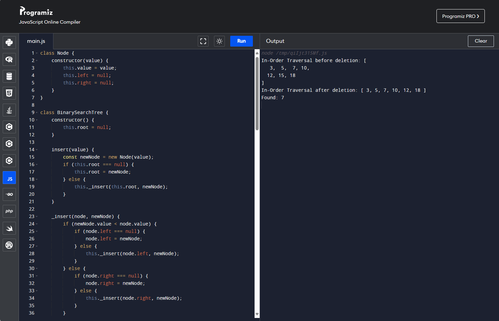

class Node {
    constructor(value) {
        this.value = value;
        this.left = null;
        this.right = null;
    }
}

class BinarySearchTree {
    constructor() {
        this.root = null;
    }

    insert(value) {
        const newNode = new Node(value);
        if (this.root === null) {
            this.root = newNode;
        } else {
            this._insert(this.root, newNode);
        }
    }

    _insert(node, newNode) {
        if (newNode.value < node.value) {
            if (node.left === null) {
                node.left = newNode;
            } else {
                this._insert(node.left, newNode);
            }
        } else {
            if (node.right === null) {
                node.right = newNode;
            } else {
                this._insert(node.right, newNode);
            }
        }
    }

    search(value) {
        return this._search(this.root, value);
    }

    _search(node, value) {
        if (node === null || node.value === value) {
            return node;
        }
        if (value < node.value) {
            return this._search(node.left, value);
        }
        return this._search(node.right, value);
    }

    delete(value) {
        this.root = this._delete(this.root, value);
    }

    _delete(node, value) {
        if (node === null) {
            return null;
        }

        if (value < node.value) {
            node.left = this._delete(node.left, value);
        } else if (value > node.value) {
            node.right = this._delete(node.right, value);
        } else {
            if (node.left === null) {
                return node.right;
            } else if (node.right === null) {
                return node.left;
            }

            const minLargerNode = this._findMin(node.right);
            node.value = minLargerNode.value;
            node.right = this._delete(node.right, minLargerNode.value);
        }
        return node;
    }

    _findMin(node) {
        while (node.left !== null) {
            node = node.left;
        }
        return node;
    }

    inOrderTraversal() {
        const result = [];
        this._inOrderTraversal(this.root, result);
        return result;
    }

    _inOrderTraversal(node, result) {
        if (node !== null) {
            this._inOrderTraversal(node.left, result);
            result.push(node.value);
            this._inOrderTraversal(node.right, result);
        }
    }
}

// 示例使用
const bst = new BinarySearchTree();
bst.insert(10);
bst.insert(5);
bst.insert(15);
bst.insert(3);
bst.insert(7);
bst.insert(12);
bst.insert(18);

console.log("In-Order Traversal before deletion:", bst.inOrderTraversal());

bst.delete(15);

console.log("In-Order Traversal after deletion:", bst.inOrderTraversal());

const found = bst.search(7);
if (found) {
    console.log("Found:", found.value);
} else {
    console.log("Not Found");
}

